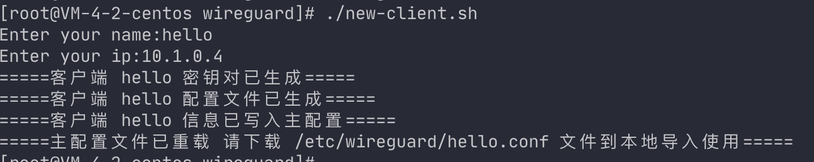

# my-wireguard

wireguard配置工作，使用脚本快速初始化服务端和客户端。

## 准备工作

开启转发

 `sysctl -w net.ipv4.ip_forward=1`

## 安装 

 `yum install wireguard`

## 配置服务端

在云服务器生成网关节点密钥对并配置到配置文件。

```shell
# 进入wireguard的工作目录
cd /etc/wireguard
#在此文件夹下执行脚本
./init-server.sh
```

* 默认端口：16000
* 组网网断：10.1.0.1/24

> 如需调整可自行编辑 `init-server.sh` 的配置

## 配置客户端

在客户端生成客户端节点密钥对并配置到配置文件

```shell
# 进入wireguard的工作目录
cd /etc/wireguard
#在此文件夹下执行脚本
./new-client.sh
```

交互式输入要配置的client节点的用户名和网络ip, 程序会在当前文件夹生成一对公钥和私钥，并生成节点所需要的配置文件并就配置写入到`wg0.conf`文件

**example：**



当前目录下生成的配置文件如下


## 运行

使用 `wg-quick` 命令

启动服务端：

 `wg-quick up wg0`

ps：默认取 `/etc/wireguard/$name.conf`

如果需要使用指定配置文件启动
 `wg-quick up /etc/wireguard/wg0.conf`

关闭服务端：

 `wg-quick down wg0`

重载配置

`wg synccwg syncconf wg0 <(wg-quick strip wg0)
`

## 其他
